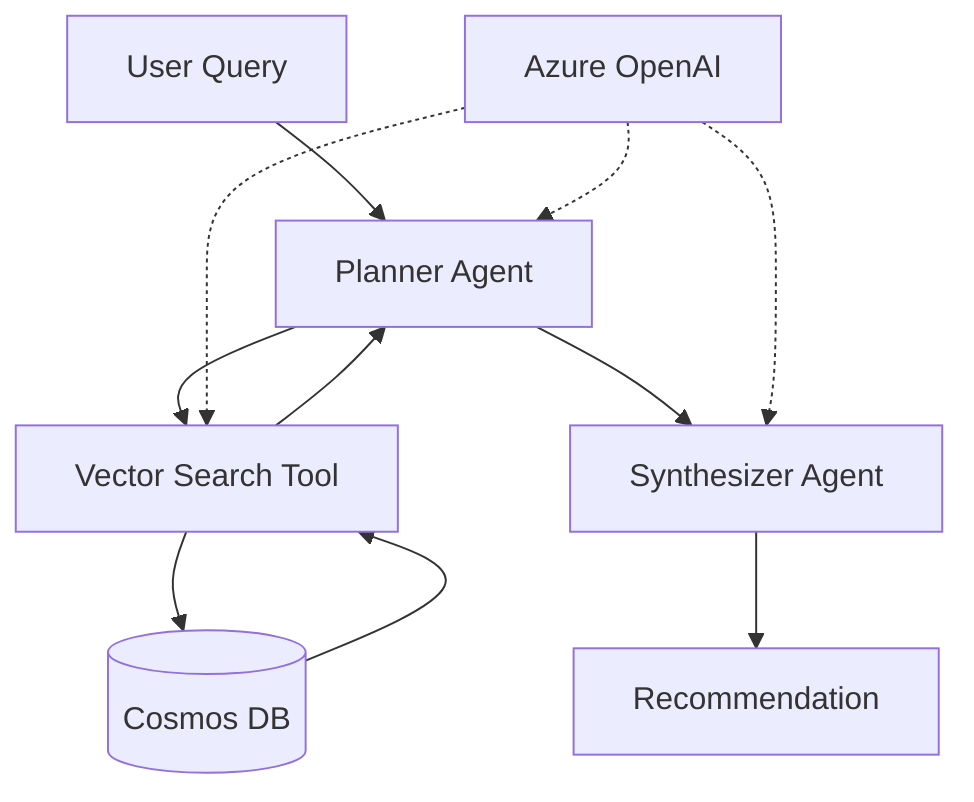
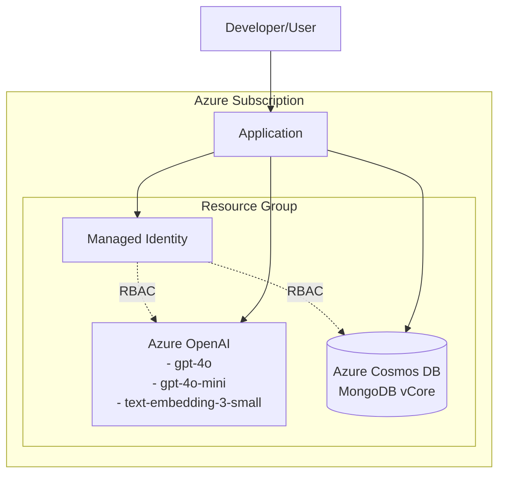

# Documentation Generation Prompt Template

Use this prompt template to generate comprehensive documentation for any TypeScript developer experience project. Replace the placeholders in `[BRACKETS]` with your project-specific information.

---

## Master Prompt for Documentation Generation

```
You are creating comprehensive, developer-focused documentation for a TypeScript sample project. 
Generate a complete documentation set that enables developers to understand, implement, and 
adapt this solution to their preferred language/framework.

### Project Context

**Project Name**: [PROJECT_NAME]
**Domain**: [DOMAIN/INDUSTRY - e.g., "Hotel recommendations", "E-commerce search", "Healthcare chatbot"]
**Core Technology Stack**:
- Primary Language: TypeScript
- Key Framework: [FRAMEWORK - e.g., "LangChain", "Express", "NestJS"]
- Cloud Services: [AZURE_SERVICES - e.g., "Azure OpenAI, Cosmos DB, Azure Functions"]
- Additional Technologies: [OTHER_TECH - e.g., "Vector search, MongoDB, Redis"]

**Target Audience**: 
- Primary: [PRIMARY_AUDIENCE - e.g., "Full-stack developers building AI agents"]
- Secondary: [SECONDARY_AUDIENCE - e.g., "Python/C#/Java developers adapting this to their language"]

**Business Problem Solved**: [PROBLEM_STATEMENT - e.g., "Users can't find relevant hotels using keyword search; they need semantic, context-aware recommendations"]

**Technical Challenge**: [TECH_CHALLENGE - e.g., "Implementing RAG with multi-agent orchestration, vector search, and passwordless Azure authentication"]

---

### Required Documentation Files

Generate the following files with these specifications:

#### 1. FUNCTIONAL-SPEC.md
**Purpose**: Language-agnostic technical specification

**Required Sections**:
- Overview (Application type, domain, tech stack, core capability)
- System Architecture
  - High-level flow diagram (text-based)
  - Component breakdown with inputs/outputs
- Data Model
  - Complete schema with field descriptions
  - Which fields are indexed/vectorized
  - Data validation requirements
- Azure Resources Required
  - Each Azure service needed
  - Required configurations and SKUs
  - Required outputs (connection strings, endpoints)
- Authentication
  - Passwordless (Microsoft Entra ID) implementation
  - API key fallback (if applicable)
  - Token scopes and refresh logic
- Core Workflows
  - Main user flows with step-by-step breakdowns
  - Authentication flow
  - Data ingestion flow
  - Query/execution flow
- Application Entry Points
  - Each executable script/command
  - Purpose and when to use
  - Required environment variables
- API/Integration Specifications
  - [SPECIFIC_TO_YOUR_DOMAIN - e.g., "Vector Search Implementation", "Agent Pipeline", "API Endpoints"]
- Environment Configuration
  - Complete .env template with descriptions
  - Required vs optional variables
  - Validation requirements

**Tone**: Technical, precise, implementation-focused. Every detail needed to recreate in ANY language.

---

#### 2. AGENT-ORCHESTRATION.md (or equivalent domain-specific architecture doc)
**Purpose**: Deep dive into the core architectural pattern

**Replace "Agent Orchestration" with your pattern name**: 
- [ARCHITECTURE_PATTERN - e.g., "API Design Patterns", "Event-Driven Architecture", "State Machine Flow"]

**Required Sections**:
- Overview (What is this pattern? Why use it?)
- Architecture Details
  - Visual flow diagrams
  - Component responsibilities
  - Communication patterns
- Design Decisions
  - Why this approach vs alternatives
  - Tradeoffs made
  - Cost/performance implications
- Implementation Patterns
  - How to implement in different frameworks
  - LangChain example
  - Semantic Kernel example
  - Custom implementation example
  - [OTHER_FRAMEWORKS relevant to your stack]
- Prompt Engineering / Configuration
  - [DOMAIN_SPECIFIC - e.g., "Exact prompts used", "Configuration parameters", "State transitions"]
- Data Flow and Context Passing
  - How data moves through the system
  - Context preservation
  - Error propagation
- Error Handling and Debugging
  - Common failure modes
  - Debug logging strategy
  - Troubleshooting guide
- Framework Implementation Patterns
  - Comparison table across frameworks
  - Translation guide for key concepts

**Tone**: Architectural reasoning, teaching why not just what, enables informed adaptation.

---

#### 3. DEVELOPMENT-PLAN.md
**Purpose**: Step-by-step implementation roadmap

**Required Structure**:
- Prerequisites
  - What's provided (Azure infrastructure, sample data, docs)
  - What developers need to build
- Development Phases (organize into logical stages)
  
  **For each phase**:
  - Phase name and estimated timeline
  - Goal (what this phase accomplishes)
  - Tasks (detailed checklist with sub-items)
  - Code deliverables
  - Acceptance criteria (how you know it's done)
  - Common pitfalls and solutions
  
  **Example phases**:
  - Phase 1: Setup & Authentication (Days 1-2)
    - Environment setup
    - Configuration management
    - Authentication implementation
    - Client factories
    - Verification scripts
  - Phase 2: Data Layer (Days 3-4)
    - Data loading
    - Schema validation
    - [DOMAIN_SPECIFIC - e.g., "Vector embeddings", "Database schema", "API integration"]
  - Phase 3: Core Business Logic (Days 5-7)
    - [YOUR_CORE_FEATURES]
  - Phase 4: [ADDITIONAL_PHASES as needed]
  - Phase 5: Testing & Polish
    - Integration tests
    - Error handling
    - Documentation
    - Performance optimization

- Testing Strategy
  - Unit tests
  - Integration tests
  - End-to-end verification
- Deployment Considerations
- Going to Production checklist

**Tone**: Practical, actionable, hand-holding. Assumes smart developer but new to this stack.

---

#### 4. CODE.md
**Purpose**: Source code walkthrough and reference

**Required Sections**:
- Table of Contents (organized by file purpose)
- NPM Scripts and Entry Points
  - Each `npm run` command
  - What it does
  - When to use it
  - Key features
  - Flow diagram
  - How it differs from similar scripts
- Verification Scripts (if applicable)
  - Testing/validation scripts
  - What each validates
- Core Application Files
  - Main business logic files
  - Detailed explanation of purpose
  - Key functions/classes
  - Integration points
- Utility Files
  - Helper modules
  - What problems they solve
  - Reusability notes
- Configuration Files
  - package.json
  - tsconfig.json
  - [OTHER_CONFIG_FILES]
- File Dependency Map
  - Which files import which
  - Dependency graph (text-based)

**For each file**:
- Purpose (one-line summary)
- Command to run (if executable)
- What it does (detailed)
- Key features/functions
- Dependencies
- Environment variables used
- When to use vs alternatives

**Tone**: Code tour guide, explaining intent not just mechanics.

---

#### 5. SCRIPTS.md (or equivalent operational guide)
**Purpose**: How to use verification/utility scripts

**Required Sections**:
- Purpose (what these scripts accomplish)
- Quick Start
  - Single command that runs all verifications
  - Expected output
- Prerequisites
  - Infrastructure requirements
  - Authentication requirements
  - Environment setup
- Scripts
  - Primary comprehensive script (if exists)
  - Individual scripts organized by category
  
  **For each script**:
  - Name and purpose
  - What it validates/accomplishes
  - Run command
  - Expected output
  - What success looks like
  - What failure indicates
  
- Expected Output
  - Success indicators
  - Output examples
- Troubleshooting
  - Common errors with solutions
  - Debug strategies
- Environment Variables Required
  - Complete list with descriptions
  - Required vs optional
- Next Steps
  - What to do after verification succeeds
  - What to do if tests fail

**Tone**: Operational manual, quick reference, troubleshooting guide.

---

#### 6. HERO-JOURNEY.md
**Purpose**: Narrative-driven guide that makes the project engaging and relatable

**Required Narrative Structure** (Classic Hero's Journey):

1. **The Ordinary World**
   - Relatable starting point: developer facing [YOUR_BUSINESS_PROBLEM]
   - Current pain points and frustrations
   - The challenge presented (by PM, customer, or business need)
   - Why this seems daunting

2. **The Call to Adventure**
   - Discovery of your solution/technology
   - The opportunity: working TypeScript implementation
   - The challenge: team uses different languages
   - Realization: becoming the guide for others

3. **Meeting the Mentor**
   - Introduction to documentation as the mentor
   - List the key docs and what each provides
   - Emphasizing knowledge transfer over code copying
   - "You're not alone on this journey"

4. **Crossing the Threshold**
   - Taking first steps (Phase 1 of implementation)
   - The critical first challenge: [YOUR_SETUP_CHALLENGE - e.g., "authentication", "environment setup"]
   - Running verification tests
   - Success indicators
   - Team starting to notice

5. **Tests, Allies, and Enemies**
   
   **First Test**: [YOUR_FIRST_MAJOR_CONCEPT]
   - The challenge/confusion
   - The learning moment
   - How it actually works
   - Hands-on success
   
   **Second Test**: [YOUR_CORE_ARCHITECTURE]
   - Setting up stakes (what goes wrong with bad approaches)
   - Wrong approach 1 with consequences
   - Wrong approach 2 with consequences
   - The correct architecture revealed
   - Why each component matters
   - Why this pattern wins (cost, speed, maintainability)
   - Naming the pattern
   
   **Finding Allies**: 
   - Documentation becomes the ally
   - Specific docs help with specific challenges
   - Learning principles, not just copying

6. **The Ordeal**
   - Implementing in different language ([EXAMPLE_LANGUAGE])
   - Specific challenges faced
   - Returning to specifications for guidance
   - Adaptation and translation process
   - Breakthrough moment

7. **The Reward**
   - Working implementation
   - Example output showing success
   - Product manager/stakeholder reaction
   - Personal growth realized

8. **The Road Back**
   - Becoming the guide for others
   - Sharing knowledge, not just code
   - Key lessons to share (3-5 quotes)
   - Cross-language reference table
   
   | Concept | TypeScript | Python | C# | Java |
   |---------|-----------|--------|-----|------|
   | [CONCEPT_1] | [TS_IMPL] | [PY_IMPL] | [CS_IMPL] | [JAVA_IMPL] |

9. **Resurrection: Mastery Through Teaching**
   - Teammates encounter edge cases
   - Each challenge deepens understanding
   - Contributing back to project
   - Specific learnings documented (language-specific quirks)
   - Documentation evolves

10. **Return with the Elixir**
    - Timeline summary (X weeks later)
    - List of implementations created
    - The real treasure: reusable patterns (5-7 key patterns)
    - Business outcome
    - Personal transformation

11. **Your Call to Adventure**
    - Commands to get started
    - What awaits the reader
    - Empowering message
    - Links to other docs

**Tone**: Engaging narrative, relatable struggles, triumphant discoveries, empowering. Balance technical detail with storytelling. Make the reader the hero.

---

#### 7. quickstart-[YOUR-TOPIC].md
**Purpose**: Step-by-step tutorial for quick implementation

**Required Structure**:
- Title and description
- Architecture summary
  - What this builds
  - Key components
  - Why this approach
- Link to complete source code
- Prerequisites
  - Azure resources with specific requirements
  - Development tools
  - Authentication requirements
- Step-by-step Implementation
  
  **For each major section**:
  1. Clear objective
  2. Commands or code snippets
  3. Explanations of what's happening
  4. Configuration details
  5. Testing/verification
  
  **Typical sections**:
  - Create project
  - Install dependencies
  - Configure environment
  - Implement authentication
  - [YOUR_CORE_FEATURES - 3-5 major sections]
  - Test the implementation
  - Deploy (if applicable)

- Code Explanations
  - Key code blocks with detailed annotations
  - Why specific approaches were chosen
- Troubleshooting
  - Common issues with solutions
- Clean up resources
- Next steps

**Tone**: Tutorial, beginner-friendly but not condescending, clear and actionable.

---

#### 8. Mermaid Diagram Files

**Purpose**: Visual architecture diagrams for documentation and presentations

**Required Diagrams**:

##### architecture.mmd
**Purpose**: Application/code architecture showing component interactions

**Required Elements**:
- All major code components/modules
- Data flow between components
- External service integrations
- User interaction points
- Arrows showing directionality of calls/data flow
- Clear labels for each component

**Example structure**:


**Style**: 
- Use graph TD (top-down) or LR (left-right) based on complexity
- Solid arrows for data/control flow
- Dashed arrows for dependencies/services
- Cylinders for databases
- Rectangles for components
- Clear, concise labels

##### azure-architecture.mmd
**Purpose**: Azure infrastructure/resource architecture

**Required Elements**:
- All Azure resources provisioned
- Resource groups (if relevant)
- Network boundaries
- Authentication flows
- Data persistence layers
- Compute resources
- Integration points between resources
- Managed identities and RBAC relationships

**Example structure**:


**Style**:
- Use subgraphs for logical groupings (resource groups, networks)
- Include key configurations (SKUs, models deployed)
- Show authentication/authorization relationships with dashed lines
- Solid lines for data flows
- Clear labels with service names and key details

##### [OPTIONAL] data-flow.mmd
**Purpose**: Detailed data transformation pipeline (if complex)

**When to include**: For projects with multi-stage data processing

**Required Elements**:
- Data sources
- Transformation steps
- Storage points
- Output destinations
- Format changes at each stage

**Style**: Left-to-right flow (LR) typically works best

---

**Diagram Best Practices**:
1. **Simplicity**: Don't overwhelm - show key flows, hide implementation details
2. **Consistency**: Use same shapes/styles across all diagrams
3. **Labels**: Every node and edge should have clear, concise labels
4. **Legend**: Include legend if using multiple line/shape types
5. **Validation**: Ensure mermaid syntax is valid and renders correctly
6. **Comments**: Add mermaid comments for sections: `%% This is a comment`

**File Location**: Place in `docs/` folder alongside markdown documentation

---

### Cross-Cutting Requirements

**For ALL Documentation**:

1. **Language-Agnostic Focus**
   - Specifications that work for any language
   - TypeScript as reference, not requirement
   - Translation guidance provided

2. **Progressive Disclosure**
   - Quick start for beginners
   - Deep dives for advanced users
   - Clear navigation between docs

3. **Practical Focus**
   - Real code examples
   - Actual commands to run
   - Concrete success criteria

4. **Troubleshooting Throughout**
   - Common errors in every doc
   - Debug strategies
   - "What to do when..." sections

5. **Azure Best Practices**
   - Passwordless authentication emphasized
   - Cost optimization discussed
   - Security considerations
   - Scalability patterns

6. **Cross-References**
   - Docs link to related sections
   - Clear navigation path
   - "See X.md for details" pattern

7. **Code Blocks Formatted**
   - Language specified for syntax highlighting
   - Commands distinguished from output
   - Environment variables clearly marked

8. **Visual Elements** (where appropriate)
   - ASCII diagrams for flows
   - Tables for comparisons
   - Checklists for tasks
   - Callout boxes for warnings/tips

---

### Output Instructions

Generate each file with:
- Appropriate markdown formatting
- Clear section headers with anchors
- Code blocks with language tags
- Tables where comparisons are needed
- Links between related sections
- Consistent terminology throughout

**File naming convention**: 
- ALL-CAPS for major docs (FUNCTIONAL-SPEC.md)
- lowercase-with-dashes for tutorials (quickstart-[topic].md)

**Voice and Tone**:
- Active voice
- Second person ("you") for tutorials
- Third person for specifications
- Technical precision without jargon overload
- Encouraging and empowering

Generate all 7 files now.
```

---

## How to Use This Template

1. **Replace all `[BRACKETED]` placeholders** with your project-specific information
2. **Copy the completed prompt** to your AI assistant
3. **Review generated files** for accuracy and completeness
4. **Iterate on specific sections** as needed
5. **Add project-specific diagrams** (mermaid, ASCII art)
6. **Validate technical accuracy** with your implementation

## Example Replacements

For an e-commerce search project:

```
[PROJECT_NAME] → "AI-Powered Product Search"
[DOMAIN] → "E-commerce search and recommendations"
[FRAMEWORK] → "Express.js with LangChain"
[AZURE_SERVICES] → "Azure OpenAI, Azure AI Search, Azure Cosmos DB"
[PROBLEM_STATEMENT] → "Customers can't find products using basic keyword search; they need semantic understanding of product descriptions"
[ARCHITECTURE_PATTERN] → "Semantic Search Pipeline with Re-ranking"
```

## Customization Tips

- **For simpler projects**: Remove Phase 3-4 from DEVELOPMENT-PLAN.md
- **For API projects**: Add OpenAPI/Swagger spec section to FUNCTIONAL-SPEC.md
- **For infrastructure-heavy**: Add dedicated INFRASTRUCTURE.md file
- **For data-intensive**: Add DATA-PIPELINE.md file
- **For frontend projects**: Add COMPONENTS.md file

## Maintenance

Update this template when you:
- ✅ Discover better documentation patterns
- ✅ Get user feedback on what's missing
- ✅ Add new types of projects
- ✅ Improve narrative techniques in HERO-JOURNEY.md

---

*This template was created from the Azure Cosmos DB Vector Search Agent project and generalized for reuse across TypeScript developer experience projects.*
